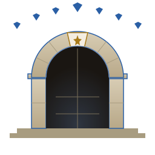

<p align="center">
  
</p>

<h1 align="center">Dwarven</h1>

<p align="center"><em>Halls of stone for software, dug deep and well-measured.</em></p>

A host-agnostic system for **specification-driven software development** with **strongly decoupled agents** and a **local coordination hub**.

> **Status:** v1 + v2 shipped. The Rust hub (CLI + daemon + SQLite index + watcher), the full HTTP API + SSE event stream, both host adapters (Claude Code and opencode), the dependency-graph scheduler, a minimum-viable web UI, and an agent-prompt eval framework are all in place. ~270 tests pass on `cargo test`. There is no crates.io release yet; build from source per [Installation](#installation).

## What Dwarven is

Dwarven orchestrates a fixed roster of focused agents to develop software against a written specification. Each agent has one responsibility, a strict tool allowlist, and a defined input/output contract. Agents cannot change roles mid-session — each is a host-native subagent dispatch with its own system prompt and tools. Coordination happens through a **local coordination hub** — a Rust binary that owns the workflow state on disk.

Four pillars:

- **Mechanism-enforced decoupling.** Every agent is a host-native subagent with isolated context and a granular tool allowlist. Drift between roles is prevented at the mechanism layer, not by prompt discipline.
- **Local coordination hub.** A single-binary daemon owns the workflow state. Issues, comments, dependencies, and state transitions live as Markdown files in your repo (`.dwarven/`); a SQLite index serves a local web UI. No GitHub dependency.
- **Dependency-aware scheduling.** Priorities reflect both your product priorities *and* each issue's downstream-unblocking value. Working on a `p1` that unblocks five `p0`s outranks a `p1` that unblocks nothing.
- **Multi-host.** A thin per-host adapter materializes the agent roster onto each supported AI coding-agent CLI. Claude Code and opencode are both supported; the contract is published so other hosts can be added.

## Core ideas

**Specifications drive everything.** A spec describes how the system *should* work; documentation describes how it *does* work. The disagreement between them is a **gap**, surfaced as an issue, broken into work, planned, tested, implemented, reviewed, and folded back into docs.

**Tests gatekeep implementation.** Tests are the executable form of the spec. Implementation cannot land without tests that verify it satisfies the spec.

**Architecture is its own concern.** A specification says what the system should do; an architecture says how the system should solve it. Architecture is owned by a distinct agent and lives in its own subtree (`docs/architecture/`).

**Decoupling is mechanism-enforced.** Every agent is a host-native subagent with its own system prompt and tool allowlist. An agent cannot mid-session decide to do another agent's job — it can only dispatch a bounded subagent that returns a single result, or hand off via hub state.

**The hub is the coordination surface.** Issues, comments, dependencies, and state transitions live in `.dwarven/` and are mediated by the `dwarven` CLI (for agents) and a local web UI (for the maintainer). There is no other shared inter-agent state.

**Files are the source of truth.** Hub-tracked artifacts live as Markdown files under `.dwarven/`, committed alongside code. The SQLite index is derived and reproducible at any time. You can edit issue files directly in your editor as an escape hatch.

**Prioritization is dynamic and dep-aware.** You assert product priorities; the hub computes effective priority by combining base priority with downstream-unblocking value across the dep graph.

**Monorepos are preferred (soft).** Architecture, gap-analysis, and triage agents see further when the spec, docs, code, tests, and hub artifacts share a workspace.

## The agent roster

| Agent | Dispatch | Scope |
|---|---|---|
| **Spec** | `/spec` (Claude Code) / `@spec` (opencode) | Evolves `docs/specs/*.md`. What the system should do. |
| **Architect** | `/architect` / `@architect` | Designs `docs/architecture/*.md`. How the system should solve the spec. |
| **Gap** | `/gap` / `@gap` | Compares spec vs. docs/code; files gap issues. |
| **PM** | `/pm` / `@pm` | Decomposes top-level gap issues into implementable child issues. |
| **Planning** | `/plan` / `@plan` | Produces `docs/plans/YYYY-MM-DD-<slug>.md` for one issue. |
| **Test Dev** | `/test` / `@test` | Writes failing tests from plan + spec. Test paths only. |
| **Implementation** | `/implement` / `@implement` | Drives failing tests to green. RED-GREEN-REFACTOR. |
| **Code Review** | `/review` / `@review` | Reviews diff against plan + spec; merges or routes back. |
| **Doc** | `/doc` / `@doc` | Updates `docs/*.md` to reflect actual code behavior. |
| **Triage** | `/triage` / `@triage` | Audits issue queue; surfaces stuck work. |

Each agent's full I/O contract — trigger, inputs, outputs, tool allowlist, exit conditions, and scope fences — is specified in [`docs/specs/agent-roster.md`](docs/specs/agent-roster.md).

## The pipeline

A specification gap becomes shipped code through a fixed sequence:

```
Spec change committed
    ↓
Gap         → creates issue (type:spec-gap, state:pm)
    ↓
PM          → child issues (type:feature, state:plan, epic:<slug>)
    ↓
Planning    → commits docs/plans/...md, transitions issue to state:test
    ↓
Test Dev    → failing tests on feat/<id>-<slug>, transitions to state:implement
    ↓
Implementation → green code, pushes branch, transitions to state:review
    ↓
Code Review → merges branch into main, transitions to state:doc
    ↓
Doc         → updates docs/*.md, appends CHANGELOG, closes issue
```

At any step, an agent that hits an unresolvable ambiguity escalates: structured comment + `blocker: maintainer-input` + transition to `state: maintainer` + exit. The maintainer responds via the web UI or CLI; the next dispatch picks up from there.

## The maintainer shell

You interact with Dwarven through a top-level session in your AI coding-agent host (Claude Code, opencode) called the **shell**. The shell is intentionally thin:

- **It can read.** Files, `git log`, `dwarven issue view`, `dwarven issue list`, `dwarven schedule next` — anything to orient.
- **It cannot write.** Every action that changes state is dispatched to an agent.
- **It dispatches by name.** `/spec`, `/plan 42`, etc. under Claude Code; `@spec`, `@plan 42` under opencode. There is no inferred routing.
- **It does not converse multi-turn about work.** Dialogue happens inside dispatched agents, not in the shell.

The shell holds broad context but no specific work. Putting writes in the shell would erode the per-agent decoupling guarantee.

## Dialogue when an agent needs help

Subagents are one-shot — they cannot converse with you across invocations. Two communication paths:

- **Interactive dispatch** (from the shell): the subagent uses the host's interactive question primitive (Claude Code's `AskUserQuestion`; opencode's free-text `question`) to clarify mid-run, then completes.
- **Detached dispatch**: the subagent posts a structured comment to the hub, sets `blocker: maintainer-input`, transitions to `state: maintainer`, and exits. You answer via the web UI; the next dispatch reads the new state.

The interactive primitive is allowlisted only on dialogue agents (Spec, Architect, Gap, PM, Planning). Discrete-work agents (Test Dev, Implementation, Code Review, Doc, Triage) escalate structurally — never synchronously.

## The coordination hub

The hub is a single-binary Rust daemon that owns the workflow state. It has two execution modes:

- **CLI mode** — `dwarven <subcommand>`. One-shot operations: create an issue, post a comment, transition state, manage dependencies. CLI mode reads and writes `.dwarven/` files directly; no daemon required.
- **Daemon mode** — `dwarven serve`. Runs an HTTP server (default `127.0.0.1:7777`) that backs the local web UI, plus a file watcher that keeps the SQLite index in sync. Required only for the web UI and the SSE event stream.

Hub artifacts (issues, comments, state transitions, dependency edges) live as Markdown files with frontmatter under `.dwarven/`, committed alongside code. The SQLite index is derived and reproducible from the files at any time. You can hand-edit any artifact in your editor as an escape hatch.

Agents talk to the hub *exclusively* through the `dwarven` CLI. Per-agent allowlists scope CLI invocations granularly (e.g., the Spec agent has `dwarven --actor spec issue close:*` allowed but not `dwarven issue create:*`).

## Dependency-aware prioritization

The hub stores dependency edges between issues — "A blocks B" relationships that form a DAG. The scheduler computes an *effective priority* for each active issue:

```
score(i) = base_priority(i) + α · Σ score(j) for j ∈ blocks(i)
```

Higher `α` makes downstream-unblocking value matter more; lower `α` makes immediate base priority dominate. Default `α = 0.5`.

You can override the computed score per issue (`dwarven issue priority-override <id> <value>`) — the "I know better than the algorithm" escape hatch. Edge creation is restricted to upstream agents (Architect, PM, Planning) and you; downstream agents escalate to record edges they discover.

Full algorithm: [`docs/specs/dep-graph.md`](docs/specs/dep-graph.md). Implementation notes: [`docs/architecture/scheduler.md`](docs/architecture/scheduler.md).

## Hosts

Dwarven targets multiple AI coding-agent hosts via thin per-host adapters. Each adapter materializes the abstract agent roster ([`docs/specs/agent-roster.md`](docs/specs/agent-roster.md)) into the host's native primitives.

- **Claude Code** — reference adapter. Maps agents to `.claude/agents/`, slash commands to `.claude/commands/`, hooks to `.claude/hooks/`, settings to `.claude/settings.json`. Universal-deny enforced both via per-agent allowlists and a PreToolUse hook as a second line of defense.
- **opencode** — second adapter. Maps agents to `.opencode/agents/`, the orientation copy to `.opencode/AGENTS.md`, and the universal-deny floor to `opencode.json` at the repo root. No PreToolUse hook (opencode has no hooks system); the adapter validates at `dwarven init` time that no per-agent allow pattern shadows a global deny.

The two adapters share no on-disk artifacts. A repository may install both adapters simultaneously; each writes to its own host-specific directory; you choose which host to launch.

Full contract: [`docs/specs/host-adapter.md`](docs/specs/host-adapter.md).

## Agent-prompt evals

Substantive changes to an agent's behavioral framing (Red Flags tables, anti-rationalization language, scope-fence prose) need eval evidence before they ship. The framework lives at [`docs/architecture/agent-eval.md`](docs/architecture/agent-eval.md); scenarios under `evals/<agent>/*.yaml`; runner via `cargo run --example eval-runner -- --agent <name>`. Refuses to run without `ANTHROPIC_API_KEY`. Scenarios assert on tool-call patterns (required + forbidden) plus an optional LLM judge for response text.

## Installation

There is no crates.io release yet. Build from source:

```bash
git clone https://github.com/danieltoone/dwarven ~/path/to/dwarven
cd ~/path/to/dwarven
cargo install --path .
```

In your project repository:

```bash
# Initialize hub state and materialize the Claude Code adapter:
dwarven init --host claude-code

# Or opencode:
dwarven init --host opencode

# Or both:
dwarven init --host claude-code --host opencode

# Start the daemon (foreground; `&` to detach):
dwarven serve

# Open the web UI:
open http://127.0.0.1:7777
```

A walkthrough of filing your first issue and dispatching the first agent lives at [`docs/getting-started.md`](docs/getting-started.md).

## Repository layout

Once `dwarven init` has run, your repository contains:

```
.dwarven/                       # hub-tracked artifacts (committed)
├── config.toml                 # per-repo configuration
├── issues/<padded-id>/         # one directory per issue
│   ├── issue.md                # frontmatter + body
│   └── comments/               # state-change + free-form comments
├── .index.sqlite               # derived; gitignored
└── .daemon.pid                 # daemon lifecycle; gitignored

docs/
├── specs/                      # what the system should do
├── architecture/               # how the system should solve it
├── plans/                      # implementation plans, one per slice
└── CHANGELOG.md

.claude/                        # Claude Code adapter materialization
├── agents/<name>.md            # one subagent per dispatched agent
├── commands/<name>.md          # one slash command per agent
├── hooks/{session-start,pre-tool-use}.sh
└── settings.json

.opencode/                      # opencode adapter materialization
├── agents/<name>.md            # one subagent per dispatched agent (mode: subagent)
└── AGENTS.md                   # orientation copy auto-loaded at session start

opencode.json                   # opencode adapter global permission floor (root-level)
```

## Spec versioning

Specs live flat at `docs/specs/*.md`. The top-level spec ([`docs/specs/dwarven.md`](docs/specs/dwarven.md)) lists its constituent specs in frontmatter; each constituent owns one concern (storage, CLI, web API, web UI, work states, dialogue, agent roster, host adapter, coordination hub, dep graph).

`docs/CHANGELOG.md` tracks all changes from v2.0.0 forward. On the first breaking spec change after v2.0.0, existing specs migrate to `docs/specs/v2/` and the new major version goes to `docs/specs/v3/`. The migration is a `git mv`; tooling is deferred until v3 actually exists.

## What's shipped

| Surface | State |
|---|---|
| `dwarven` CLI | All `R6.x` subcommands per [`docs/specs/dwarven-cli.md`](docs/specs/dwarven-cli.md) (`init`, `issue {create,view,list,transition,comment,close,blocker {set,clear},priority,priority-override,edit,dep {add,remove}}`, `serve`, `daemon {status,stop,restart}`, `reindex`, `config {get,set}`, `schedule next`). |
| Daemon | PID-locked single-instance per repo, signal handling, file watcher with debounced reindex, periodic reconciliation, SQLite integrity + schema-version probe at startup. |
| HTTP API | Full surface per [`docs/specs/web-api.md`](docs/specs/web-api.md) — issues, comments, transitions, blocker, priority, dependencies, daemon, config, scheduler endpoints + SSE event stream at `/api/v1/events` with `Last-Event-ID` replay. |
| Web UI | Inbox, Issues list with URL-state filter persistence, Issue detail with full mutation UI, Dependencies graph (hand-rolled SVG, focus + N-hop + epic-clustered), Schedule with override controls, Daemon ops, Config form. Real-time updates via SSE. |
| Claude Code adapter | `dwarven init --host claude-code` materializes 23 files into `.claude/`. |
| opencode adapter | `dwarven init --host opencode` materializes 13 files into `.opencode/` + `opencode.json` at root. Materialize-time R13 shadow validation. |
| Dep-graph scheduler | `score(i) = base + α · Σ score(blocks)`, DFS-with-memo, cycle detection. CLI: `dwarven schedule next`. HTTP: `GET /api/v1/scheduler/queue`. |
| Eval framework | YAML scenarios, mock-tool runner, Anthropic API tool-use loop, optional LLM-judge. `cargo run --example eval-runner`. |
| Tests | ~270 tests, all green. `cargo test` runs in ~10s. |

## Documentation

- **For new users:** [`docs/getting-started.md`](docs/getting-started.md) — quickstart walkthrough.
- **For everyday use:** [`docs/cli-reference.md`](docs/cli-reference.md) — every subcommand + flag + example. [`docs/configuration.md`](docs/configuration.md) — every config.toml key.
- **For integrations:** [`docs/http-api-reference.md`](docs/http-api-reference.md) — endpoint catalog with examples.
- **For the maintainer:** [`docs/web-ui.md`](docs/web-ui.md) — web UI walkthrough. [`docs/troubleshooting.md`](docs/troubleshooting.md) — common issues and recovery.
- **Specifications** under [`docs/specs/`](docs/specs/) — what the system should do.
- **Architecture** under [`docs/architecture/`](docs/architecture/) — how the system actually solves it.
- **In-session context** in [`CLAUDE.md`](CLAUDE.md) — used by Claude Code; load-bearing project context.

## Philosophy

- **Specification-driven.** Specs describe how the system *should* work; documentation describes how it *does*. Specs drive tests; tests gatekeep implementation.
- **Decoupling at the mechanism.** Each agent is a host-native subagent with enforced tool allowlist and path scope.
- **Local coordination, files first.** State lives in your repo, in human-readable files, mediated by a single local binary. No external service dependencies.
- **One problem per branch.** Describe the problem, not just the change.
- **Process before implementation.** Spec, architecture, and gap analysis run upstream of test development and implementation. Don't shortcut to coding when an upstream gap is the actual problem.
- **Skills are behavior-shaping code, not prose.** Changes to discipline framing need eval evidence.

## License

MIT — see `LICENSE`.
